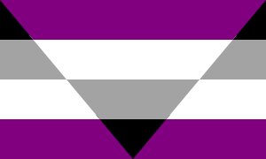
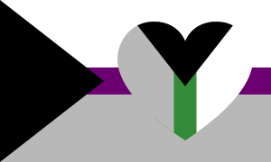
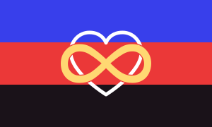

# Pride SVG

## About

This folder contains a number of pride flags set at 300x180mm in scalable vector graphic format. This arose from my need to have to repeatedly look up flags for any pride-related art projects, most of the time for exact color palettes/etc. Making this a part of my personal repo makes things easier. These are all done manually based off of accepted designs, if applicable; as such there may be slightly incorrect stripe ratios (I will try to calculate them to the best of my ability; for some, if the result of division is an unending decimal, I round; ask to PR if something's off). Some stripes may have rectangle sizes that are larger than what is visible, in order to prevent rendering artifacts (such as a pixel of transparency).

## Licensing

As per the license file, these are of course public domain.

## Naming Scheme

Organized in the following manner: prefix_primary-secondary (secondary is if applicable)

### Prefixes

- `a_` : aspec (asexual spectrum)
- `c_` : subculture
- `g_` : gender non-conforming
- `r_` : romantic attraction*
- `s_` : sexuality

\*due to the sheer number of combinations that are possible with the romantic attraction flags, these are simply 'templates' (pre-sized) that one can copy-paste onto a flag of their choice; the demisexual x-romantic flags already existed before these were added + have a different heart size/placement that is mostly unique to the demisexual flag, so they weren't removed

## Catalog

For easy viewing; organized in alphabetical order

### Aspec

  
  
  
  
  
  
  
  
  
  
  
  
  
  
  

### Subculture

  
  
  
  
  

### Gender Non-Conforming

  
  
  
  
  
  
  
  
  
  
  
  
  
  
  
  
  
  
  
  
  
  
  
  

### Romantic Attraction

  
  
  
  
  
  
  
  

### Sexuality

  
  
  
  
  
  
  
  
  
  
  
  
  

